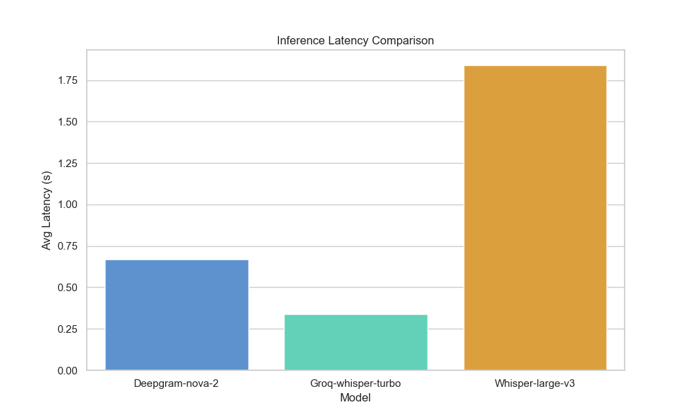
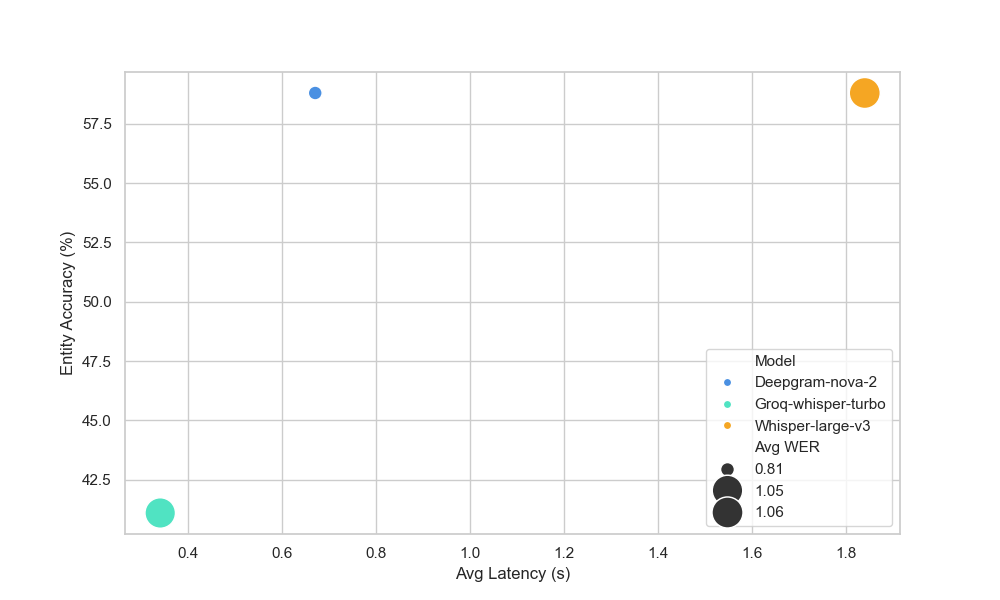

# Final ASR Benchmarking Report: Indian Conversational Telephony Evaluation

## 1. Objective
This project benchmarks Automatic Speech Recognition (ASR) systems for noisy Indian conversational speech, focused on locality-name extraction for telephony-based hiring workflows. The evaluation emphasizes operational entity recovery, latency, and robustness under real-world recording conditions rather than simple transcription quality.

## 2. Dataset & Evaluation Setup
The benchmark utilizes 20 self-recorded audio samples captured via a phone microphone to simulate real-world telephony conditions. The speech is "Hinglish" (Hindi-English code-switching) containing Bangalore-specific locality names spoken at natural conversational speeds.

### Noise Distribution
| Condition | Samples | Description |
| :--- | :--- | :--- |
| Quiet Room | 4 | Baseline recordings with minimal background noise. |
| Fan Noise | 4 | Constant low-frequency interference. |
| Public Noise | 3 | Background chatter and ambient office/cafe noise. |
| Traffic Noise | 6 | High-frequency car horns and engine rumble. |
| Phone Call | 3 | Simulated telephony compression and signal loss. |

## 3. Models Evaluated
| Model | Type | Strategic Reason for Selection |
| :--- | :--- | :--- |
| **Deepgram Nova-2** | Cloud API | Industry-standard production baseline for telephony. |
| **Whisper Large-v3** | Local OSS | High-accuracy multilingual benchmark for self-hosted needs. |
| **Groq Whisper Turbo** | Hosted OSS | Evaluation of LPU-accelerated low-latency infrastructure. |

## 4. Metrics
| Metric | Significance |
| :--- | :--- |
| **WER / CER** | Measures phonetic transcription robustness and character-level stability. |
| **Entity Accuracy** | **Primary Metric**: Success rate in recovering specific Bangalore locality names. |
| **Avg Latency** | Critical for real-time telephony responsiveness. |

**Engineering Decision: Transliteration-Augmented Fuzzy Matching**
Entity accuracy utilizes a custom **Transliteration Layer (`indic-transliteration`)** combined with fuzzy logic. This is necessary because models like Whisper often default to non-Latin scripts for localities. By **transliterating outputs into a normalized Latin-script representation** before matching, we ensure that a correct phonetic recognition is counted as a success even if the script differs from the ground truth.

## 5. Benchmark Results
| Model | Avg WER | Avg CER | Entity Accuracy | Avg Latency |
| :--- | :--- | :--- | :--- | :--- |
| **Deepgram Nova-2** | **0.81** | **0.59** | **58.8%** | 0.67s |
| **Groq Whisper Turbo** | 1.05 | 0.82 | 41.1% | **0.34s** |
| **Whisper Large-v3** | 1.06 | 0.81 | **58.8%** | 1.84s |

> **Hardware Context:** Whisper Large-v3 inference was executed locally on consumer GPU hardware (RTX 3050 6GB VRAM), highlighting the practical latency and deployment constraints of self-hosted multilingual ASR systems.

### Performance Visualizations

*Figure 1: Groq leads in speed (0.34s), while Whisper (1.84s) shows the highest local latency.*

*Figure 2: The "Production Sweet Spot" - Deepgram provides the best accuracy-to-latency ratio.*

**Impact of Methodology on Results:**
Strict exact-match evaluation initially underestimated operational locality recovery, particularly for transliterated outputs such as "White field" vs. "वाइट फील्ड". Incorporating transliteration-aware fuzzy matching materially improved recoverable entity accuracy for Whisper-family models, showing that while script-mismatches occur, the underlying phonetic recognition remains operationally viable.

> **Surprising Observation:** Despite using the same underlying Whisper-family architecture, Groq Whisper Turbo dramatically improved inference latency without meaningfully improving transcription robustness. This suggests that infrastructure acceleration alone is insufficient for improving noisy Hinglish entity recovery; model-level fine-tuning or domain-specific language models remain necessary for high-accuracy locality extraction.

## 6. Failure Analysis
Identifying specific failure modes is necessary for evaluating the operational stability of automated hiring workflows.

### Failure Deep-Dive Table
| Reference | Transcript Output | Failure Mode | Technical Root Cause |
| :--- | :--- | :--- | :--- |
| **Bommanahalli** | `Common हल्दी` (Deepgram) | **Semantic Bias** | Phonetic mapping to common vocabulary in high-probability Hindi phrases. |
| **KR Puram** | `this is my tot 해요` (Groq) | **Output Instability** | Model output became unstable under noisy multilingual conditions. |
| **Yeshwanthpur** | `یشمن پورس سے बस...` (Whisper) | **Script Inconsistency** | Inconsistent script selection during high-traffic noise segments. |
| **Banashankari** | `बने शंकरी` (Groq) | **Phonetic Drift** | Vowel-shift in South Indian locality names during fast speech. |

### Operational Observations
1. **Multilingual Script Instability:** Results showed Whisper/Groq switching to Urdu, Arabic, and even Korean scripts (Row 46) during noisy traffic segments. 
    *   **Engineering Impact:** This introduces downstream parsing challenges for address extraction systems, as these services may not support non-Latin or non-Devanagari character sets.

2. **Semantic Bias (Deepgram):** Deepgram's tendency to transcribe localities as common phrases (e.g., `Bommanahalli` -> `Common हल्दी`) suggests the model prioritizes high-probability vocabulary over specific proper nouns like locality names.

3. **VAD / Noise Suppression Sensitivity:** In high fan-noise conditions (Row 8), Deepgram occasionally returned an empty string. This suggests that the Voice Activity Detection (VAD) or noise-suppression parameters may be overly aggressive in filtering low-amplitude speech segments.

## 7. Production Tradeoff Analysis
| Dimension | Deepgram | Whisper | Groq |
| :--- | :--- | :--- | :--- |
| **Accuracy** | **High** | Medium | Medium |
| **Latency** | Excellent | Poor | **Exceptional** |
| **Deployment** | API-only | Self-Hosted | Cloud-Hosted |
| **GPU Need** | No | **Yes (CUDA)** | No |
| **Infrastructure** | Low Complexity | High Complexity | Low Complexity |

## 8. Final Recommendation
Based on the benchmark data, **Deepgram Nova-2** is the recommended system for Indian telephony workflows. It provides the most stable multilingual behavior and superior locality entity preservation under noisy conditions. For production telephony systems where downstream entity extraction reliability is more important than perfect sentence transcription, Deepgram provided the most operationally stable behavior across varied noise conditions.

*   **Groq Whisper Turbo** is recommended for low-latency requirements where high inference speed is the primary priority.
*   **Whisper Large-v3 (Local GPU)** is a viable self-hosted alternative if strict data privacy is required and 1.8s latency is acceptable.

## 9. Limitations
*   **Dataset Size:** 20 samples provide a directional benchmark but lack statistical significance for high-scale deployment.
*   **Streaming:** This benchmark evaluated batch processing; real-world telephony may require streaming ASR evaluation.
*   **Speaker Diversity:** Results are limited to a single speaker profile; performance may vary with regional accents.
